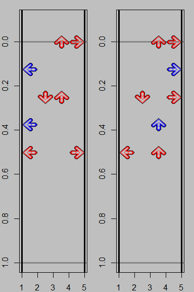

Readme DDR_Pattern_Search
================
N Robertson

<https://nrobertson573.shinyapps.io/shinyapp/>

This RShiny application is design to search through the available
Sinlges charts on Dance Dance Revolution A20 PLUS for occurrences of a
specified step pattern. Trying to learn crossovers but having a hard
time with the charts suggested by the community? This tool can search
for crossover patterns in charts with specified criteria (e.g. level
9-12 charts under 160 BPM).

Functionality is broken down into three steps.

-   Create a filter list of charts to search over
-   Specify a pattern to search for
-   Initiate search and browse results

# Filter list

Possible elements to filter over include

-   Minimum and Maximum chart level, ranges from 1 to 19
-   Minimum and Maximum BPM, ranges from 1 to 1050
-   Static BPM, require chart keep a constant bpm (no speedups or
    slowdowns)
-   Difficulty, (Beginner, Basic, Difficult, Expert and Challenge)
-   Mix, From 1st mix to A20 PLUS

BPM filters are primarily the ranges listed in game and charts may have
sections that do not match the listed BPM (e.g. Go For The Top).
Similarly, static BPM suffers from a similar issue and should be taken
to mean a chart maintains a steady BPM aside from a brief moment
(e.g. Revolutionary Addict). Additionally, some songs may have a
slightly drifting BPM (e.g. PARANOiA).

# Pattern Specification

A step pattern can be broken down to two components, the arrow sequence
and the spacing between each arrow. This app considers three cases

-   Sequence Only (only the sequence of arrows)
-   Timing Only (only the spacing between arrows)
-   Sequence and Timing (the sequence of arrows and the spacing between
    them)

To create these patterns some inputs will be required

-   Arrow Sequence: The sequence of arrows. Input sequence of arrow
    directions \[LDUR\]. e.g. L D R D L
-   Timing Between Steps: The length of note between each step. Input
    note length between previous step \[4 8 12 16 etc\]. e.g. 0 16 16 16
    16 4
-   New Step?: Pairs with arrow sequence to allow for specifying jumps
    in Sequence Only. 1 indicates new step while 0 indicates a jump with
    the previous arrow in the sequence.
-   Maximum Beats: Maximum number of beats Arrow Sequence must be found
    within for Sequence Only. Numeric Input.
-   Arrows Per Step: Pairs with Timing Between Steps to allow for
    specifying jumps in Timing Only. 1 indicates a tap while 2 indicates
    a jump. e.g. 2 1 2 1 2

All inputs should have each element separated by either spaces or
commas.

## Sequence Only

Sequence Only considers the sequence of arrow occurrences and not the
timing of each step. Requires

-   Arrow Sequence
-   New Step?
-   Maximum Beats

As an example

    Arrow Sequence
    L D U U R L D U R
    New Step?
    1 1 1 1 0 1 1 1 0
    Maximum Beats
    3

Generates the following plot.

<!-- -->

The visual is set to find the largest even spacing of arrows (from 4th
to 64th notes) that completes the pattern within the specified Maximum
Beats represented by the red line. In this example 8th notes are able to
fit the pattern in the required space. Below we consider the same
pattern and with Maximum Beats set to 1.5 (16th notes) and 2 (12th
notes). The search will identify any pattern which contains the
specified arrow sequence which completes within the Maximum Beats
parameter, e.g. if we specify the pattern with `Maximum Beats = 2`, the
search will identify the 16th note version as the pattern occurs in less
beats than Maximum Beats, but will not identify the 8th note version.

<!-- -->

This pattern specification will identify patterns in charts that are not
equally spaced. Take this standard crossover pattern.

    Arrow Sequence
    L D R D L D R D L D R
    New Step?
    1 1 1 1 1 1 1 1 1 1 1
    Maximum Beats
    5

This pattern is pictured below on the left while the pattern on the
right would be picked up by searching for our example pattern.

<!-- -->

## Timing Only

Timing Only requires specifying the following.

-   Arrows Per Step
-   Timing Between Steps

This type of pattern only cares about the rhythm or spacing between
steps and whether any steps are jumps. Consider the following which
specifies a sequence of 8th note jump-step-jump-step-jump. Note: the
first element of Timing Between Steps should be 0 as there is no prior
step to have a between.

    Arrows Per Step
    "2 1 2 1 2"
    Timing Between Steps
    "0 8 8 8 8"

The visual will generate random arrow directions that fit the specified
rhythm. Below are two runs of the of the visual generation that have the
exact same input and will generate the exact same search output.

<!-- -->

## Sequence and Timing

Sequence and Timing requires the following input.

-   Arrow Sequence
-   Timing Between Steps

This type of pattern specification searches for exact matches of rhythm
and arrow sequence. Consider the following pattern from Over the Period
CSP.

    Arrow Sequence
    "R D L R L D R"
    Timing Between Steps
    "0 16 16 8 8 16 16"

<!-- -->

The result is exactly the sequence of arrows and timing.

## Timing Between Steps Spacers

Some patterns have rhythms that may be create by using spacers, i.e. a
way to specify the timing between two arrows using multiple notes. An
example.

    Arrow Sequence
    "L 0 L D 0 D U 0 U R 0 R"
    Timing Between Steps
    "0 8 16 16 8 16 16 8 16 16 8 16"

<!-- -->

A 0 is inserted into the arrow sequence so that the 8 and 16 may be
combined together to define the spacing for gallops. This is also
possible with Timing Only patterns by placing the 0 in the Arrows Per
Steps input.

# Searching and Results

Once a filter and pattern are specified a search is run by hitting the
Run Search button. Searching over all charts may take around 30 seconds
with small searches being almost instant. Results are returned in a
sortable table containing the chart parameters as listed in the filter
table and three new columns.

-   pat_count: The amount of times the pattern is identified in the
    chart
-   pat_minbpm: The lowest BPM the pattern occurs in the song, 0 if not
    pattern not present
-   pat_maxbpm: The maximum BPM the pattern occurs in the song, 0 if not
    pattern not present

By default the table is sorted by pat_count.

## Chart Visualization

This app allows for the generating of chart visualizations highlighting
the identified patterns from search results. Underneath the search
results table is a drop down menu with the charts in your filterlist
ordered alphabetically. This drop down menu allows searching and erases
names with a single backspace.

Once a chart is selected an Xmod (e.g. 3x) may be specified to change
the spacing between arrows as the speedmods do in the arcade.
Alternatively, a maximum scroll speed may be specified which will apply
the highest Xmod which keeps chart_max_bpm below the entered value. This
calculated Xmod is listed under the input box.

Hitting the Generate Chart Visual generates the visual below.
